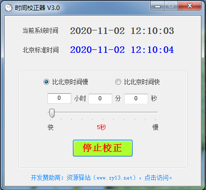

# 时间校准器
### 开发语言：C#
### 开发工具：Microsoft Visual Studio 2010
## 软件简述：
时间校准器可以帮你自动校准到北京时间，简单实用。时间校准器采用网络时服务，精准快速，且该软件体积小巧，占用电脑资源少，是一款非常实用的小工具。 
## 功能特色：
1. 电脑无忧：完美解决电脑时间错误的问题,是同步电脑时间校准的最佳助手。
2. 自动校准：通过网络读取最准确的北京时间，然后自动校准。
3. 灵活实用：可以自定义快慢节奏，有效解决部分程序对系统时间的特殊要求。
4. 操作简单：界面简洁，体积小巧，不占资源
## 软件截图：

